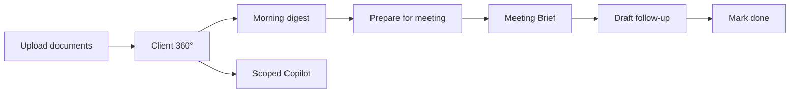

# AI CRM Feature Implementation Roadmap

**Product:** KritiFin  
**Companion doc:** [ai-crm-competitive-analysis.md](./ai-crm-competitive-analysis.md)  
**Last updated:** June 2026  
**Scope:** Documentation and planning only — no code changes in this deliverable

---

## Overview

This roadmap sequences five features that transform KritiFin from a collection of AI tools into an embedded adviser workflow. Each feature is designed for a hackathon or demo context: minimal backend change, maximum perceived polish, and reuse of existing LLM pipelines.

**Total estimated effort:** 21–31 hours (2–3 focused days)  
**Recommended team:** 1 full-stack engineer  
**Prerequisite:** Backend and frontend dev environments running per [README.md](../../README.md)

---

## Prioritised Top 5

| Priority | Feature | Complexity | Est. time | Backend change |
|----------|---------|------------|-----------|----------------|
| **P1** | Prepare-for-meeting deep links | Easy | 2–4 h | None |
| **P2** | Follow-up email from Meeting Brief | Easy | 3–5 h | Small extension |
| **P3** | Client 360° page with AI summary | Easy–Medium | 4–6 h | One new GET endpoint |
| **P4** | Morning AI digest on Dashboard | Medium | 6–8 h | One new GET endpoint |
| **P5** | Client-scoped AI Copilot | Medium | 6–8 h | Extend chat request |

---

## P1: Prepare-for-Meeting Deep Links

### Why selected

Highest score in the evaluation matrix (34/35). Zero backend work. Directly mirrors Wealthbox "Prepare" and HubSpot Breeze calendar prep — the most frequently praised adviser workflow. Connects Dashboard priorities and Alerts to the existing Meeting Brief page.

### Expected implementation time

**2–4 hours**

### Backend changes

**None.**

### Frontend changes

| File | Change |
|------|--------|
| `frontend/pages/brief.tsx` | Read `clientId` and `auto` from `router.query`; auto-select client; optionally auto-trigger `brief.mutate()` on mount |
| `frontend/pages/dashboard.tsx` | Add "Prepare" action on priority `AlertCard` rows linking to `/brief?clientId={id}&auto=1` |
| `frontend/pages/alerts.tsx` | Add row action "Prep brief" with same deep link |
| `frontend/lib/routes.ts` | Optional: helper `briefForClient(clientId: string)` |
| `frontend/components/AlertCard.tsx` | Optional: reusable `prepareHref` prop if not inlined in pages |

### APIs affected

None (uses existing `POST /api/chat/brief` via `useBrief` hook).

### Components affected

- `pages/brief.tsx`
- `pages/dashboard.tsx`
- `pages/alerts.tsx`
- `AlertCard.tsx` (optional)

### Reusable code

- `useBrief()` mutation — `frontend/hooks/useApi.ts`
- `useClients()` — client dropdown population
- Existing brief generation, talking points, PDF export

### Acceptance criteria

- [ ] From Dashboard, clicking "Prepare" on a priority alert navigates to Meeting Brief with the correct client pre-selected
- [ ] When `auto=1` is present, brief generation starts automatically without an extra click
- [ ] From Alerts table, "Prep brief" row action behaves identically
- [ ] Invalid or missing `clientId` falls back gracefully (show client dropdown, no auto-generate)
- [ ] Browser back button returns to originating page without error
- [ ] Playwright: add or extend test for deep-link flow (`data-testid="generate-brief-button"` still works)

---

## P2: Follow-Up Email from Meeting Brief

### Why selected

Completes a feature already promised in the Meeting Brief page intro ("draftable follow-up"). Wealthbox and HubSpot Breeze both highlight post-meeting email drafts as a top time-saver. Extends an existing endpoint rather than building a new AI pipeline.

### Expected implementation time

**3–5 hours**

### Backend changes

| File | Change |
|------|--------|
| `backend/app/routers/monitor.py` | Extend `DraftEmailRequest` to accept optional `client_id` and `context` (brief text / talking points) alongside existing `alert_id` |
| `backend/app/routers/monitor.py` | Branch prompt logic: alert-based (existing) vs brief-based (new) |
| `backend/app/services/cache.py` | Cache key pattern: `draft:brief:{client_id}:{hash(context)}` with 30 min TTL |

**Validation:** Require either `alert_id` OR (`client_id` + `context`). Reject empty requests with 400.

**Prompt sketch (brief-based):**
```
Draft a professional follow-up email for {client_name} after a financial advice meeting.
Reference these talking points and open action items. UK English, 2–4 paragraphs.
Talking points: {talking_points}
Brief context: {context}
```

### Frontend changes

| File | Change |
|------|--------|
| `frontend/pages/brief.tsx` | Add "Draft follow-up email" button below generated brief; open modal on click |
| `frontend/components/DraftEmailModal.tsx` | Generalise to accept `alertId` OR `{ clientId, context }` props |
| `frontend/hooks/useApi.ts` | Extend `useDraftEmail` or add `useDraftBriefFollowUp(clientId, context)` |
| `frontend/lib/types.ts` | Add request/response types for brief follow-up |

**Also include (from F7):**
- Copy to clipboard (already exists in modal)
- "Open in email client" via `mailto:` with subject line pre-filled

### APIs affected

- `POST /api/monitor/draft-email` — extended request body (backward compatible)

### Components affected

- `pages/brief.tsx`
- `components/DraftEmailModal.tsx`
- `hooks/useApi.ts`
- `lib/types.ts`

### Reusable code

- `DraftEmailModal` UI and copy flow
- Existing LLM draft generation pattern in `monitor.py`
- Cache invalidation pattern from alert drafts

### Acceptance criteria

- [ ] After generating a brief, user can click "Draft follow-up email"
- [ ] Modal shows loading skeleton, then draft text grounded in brief and talking points
- [ ] Copy to clipboard works
- [ ] "Open in email client" opens `mailto:` with subject and body populated
- [ ] Existing alert-based draft email on Dashboard/Alerts is unchanged
- [ ] Draft is cached per client + context hash for 30 minutes
- [ ] API returns 400 if neither `alert_id` nor `client_id`+`context` provided

---

## P3: Client 360° Page with AI Summary

### Why selected

Core CRM expectation. Every competitor surfaces a client record as the primary navigation destination. KritiFin has rich per-client data in Postgres and Qdrant but no page to display it. Unlocks future features (scoped chat, prepare links from client context).

### Expected implementation time

**4–6 hours**

### Backend changes

| File | Change |
|------|--------|
| `backend/app/routers/monitor.py` | Add `GET /api/monitor/clients/{client_id}` |
| `backend/app/routers/monitor.py` | Response: client profile fields, `raw_profile_json`, pending alerts (next 90 days), overdue follow-ups, document count (join or subquery on ingest metadata if available; else 0) |

**Optional AI summary (recommended for demo):**
- Reuse `_generate_brief()` with a shorter prompt variant, OR
- Add `GET /api/monitor/clients/{client_id}/summary` that returns cached 2–3 sentence relationship summary
- Cache key: `summary:{client_id}`, TTL 1 h

### Frontend changes

| File | Change |
|------|--------|
| `frontend/pages/clients/index.tsx` | **New** — client list table (name, last review, assets, open alert count) |
| `frontend/pages/clients/[id].tsx` | **New** — client 360° detail view |
| `frontend/lib/routes.ts` | Add `clients: "/clients"`, `clientDetail: (id) => "/clients/${id}"` |
| `frontend/components/AppLayout.tsx` | Add "Clients" nav item under General group |
| `frontend/hooks/useApi.ts` | Add `useClients()` (exists), `useClientDetail(id)`, optional `useClientSummary(id)` |

**Client 360° page sections:**
1. Header — client name, last review date, risk score badge  
2. Profile snapshot — assets, retirement target, cash savings from structured fields  
3. Open alerts — filtered `AlertCard` list with draft email + mark done  
4. AI relationship summary — brief card or truncated brief  
5. Actions — "Prepare for meeting" (P1 link), "Ask about this client" (P5 link)

### APIs affected

- **New:** `GET /api/monitor/clients/{client_id}`
- **Optional new:** `GET /api/monitor/clients/{client_id}/summary`
- **Existing reused:** `POST /api/chat/brief`, `POST /api/monitor/draft-email`, `PATCH /api/monitor/alerts/{id}/status`

### Components affected

- `pages/clients/index.tsx` (new)
- `pages/clients/[id].tsx` (new)
- `components/AppLayout.tsx`
- `components/AlertCard.tsx`
- `components/DraftEmailModal.tsx`
- `lib/routes.ts`
- `hooks/useApi.ts`

### Reusable code

- `GET /api/monitor/clients` list logic
- `AlertCard`, `DraftEmailModal`, `Badge`, `Card`, `PageIntro`, `EmptyState`
- Brief generator for summary card
- Alert query patterns from pulse endpoint

### Acceptance criteria

- [ ] "Clients" appears in sidebar navigation
- [ ] Client list shows all clients with key profile fields
- [ ] Clicking a client opens detail page with profile, alerts, and AI summary
- [ ] "Prepare for meeting" deep-links to `/brief?clientId={id}&auto=1`
- [ ] Draft email and mark done work from client detail alerts
- [ ] 404 or friendly error for invalid client ID
- [ ] Empty state when no clients exist (links to Ingestion)
- [ ] Playwright: nav link and client detail page render with mock data

---

## P4: Morning AI Digest on Dashboard

### Why selected

Salesforce Einstein and Wealthbox both lead with a daily priority narrative. KritiFin's Dashboard shows raw KPIs and alert cards but lacks the "here's what matters today" framing that makes AI feel proactive. One new LLM call over existing pulse data delivers high demo impact.

### Expected implementation time

**6–8 hours**

### Backend changes

| File | Change |
|------|--------|
| `backend/app/routers/monitor.py` | Add `GET /api/monitor/digest?simulated_date=YYYY-MM-DD` |
| `backend/app/routers/monitor.py` | Internally call pulse-building logic; serialise priorities, review-overdue, follow-ups, KPIs to JSON |
| `backend/app/routers/monitor.py` | LLM prompt: 3–4 sentence UK IFA briefing mentioning client names, urgency, suggested first action |
| `backend/app/services/cache.py` | Cache key: `digest:{simulated_date}:{hash(pulse_json)}`, TTL until end of simulated day or 1 h |

**Model:** `BRIEF_LLM_MODEL` / `gpt-4o-mini` for speed and cost.

**Rate limit:** 30/minute (consistent with other LLM routes).

### Frontend changes

| File | Change |
|------|--------|
| `frontend/pages/dashboard.tsx` | Add `DigestCard` hero section above KPI row |
| `frontend/hooks/useApi.ts` | Add `useDigest(simulatedDate)` |
| `frontend/lib/types.ts` | Add `DigestResponse { digest: string; generated_at: string }` |

**DigestCard UX:**
- Sparkles icon + "Today's briefing" heading
- Skeleton while loading
- Collapsible after first read (localStorage key per date)
- Regenerate button (bypasses cache via query param or cache bust)
- Respects `DateSimulator` — changing date refetches digest

### APIs affected

- **New:** `GET /api/monitor/digest`

### Components affected

- `pages/dashboard.tsx`
- `hooks/useApi.ts`
- `lib/types.ts`
- Optional: `components/DigestCard.tsx` (extract if dashboard grows)

### Reusable code

- Pulse endpoint logic in `monitor.py`
- Cache layer
- Dashboard `DateSimulator` and simulated date state
- Card, Skeleton, Sparkles icon patterns

### Acceptance criteria

- [ ] Dashboard shows AI-generated digest on load
- [ ] Digest mentions specific client names from current pulse data
- [ ] Changing simulated date updates the digest
- [ ] Loading state shown; error state with retry on LLM failure
- [ ] Response cached — repeated loads within TTL do not re-call LLM
- [ ] Digest remains readable when no alerts exist ("Your book is clear today…")
- [ ] Does not block rendering of KPI cards and priority list (parallel fetch)

---

## P5: Client-Scoped AI Copilot

### Why selected

Attio "Ask Attio", Wealthbox AI Assistant, and HubSpot Breeze all provide CRM-grounded chat. KritiFin's copilot is book-wide only. Backend already filters Qdrant by `client_id` — this is primarily an API parameter and UI exposure task.

### Expected implementation time

**6–8 hours**

### Backend changes

| File | Change |
|------|--------|
| `backend/app/routers/chat.py` | Add optional `client_id: Optional[str]` to `ChatRequest` |
| `backend/app/routers/chat.py` | When set: pass `client_id` to `_search_qdrant()`; narrow structured context to that client's alerts and profile |
| `backend/app/routers/chat.py` | Update cache key: `chat:{hash(query)}:{client_id or 'all'}` |
| `backend/app/routers/chat.py` | Validate `client_id` exists; return 404 if not found |

**Structured context (scoped):** Client row, their pending alerts, their overdue follow-ups, review status — omit full book list.

### Frontend changes

| File | Change |
|------|--------|
| `frontend/pages/chat.tsx` | Add client filter dropdown (default: "All clients") |
| `frontend/pages/chat.tsx` | Read `clientId` from `router.query` for deep links from Client 360° |
| `frontend/pages/chat.tsx` | Swap suggestion chips when client scoped (client-specific prompts) |
| `frontend/hooks/useApi.ts` | Pass `client_id` in `useChat` mutation body |
| `frontend/lib/types.ts` | Extend chat request type |

**Client-scoped suggestion chips (examples):**
- "What protection gaps does this client have?"
- "Summarise open action items for this client"
- "What did we discuss in recent meeting notes?"

### APIs affected

- `POST /api/chat` — extended request body (backward compatible)

### Components affected

- `pages/chat.tsx`
- `pages/clients/[id].tsx` — "Ask about this client" link
- `hooks/useApi.ts`
- `lib/types.ts`

### Reusable code

- `_search_qdrant(client_id=...)` — already implemented
- `_get_structured_context()` — refactor to accept optional `client_id`
- Chat UI, markdown rendering, source citations
- `useClients()` for dropdown

### Acceptance criteria

- [ ] Copilot page has client filter dropdown defaulting to "All clients"
- [ ] Selecting a client scopes answers to that client's data and documents
- [ ] Sources shown are predominantly from the selected client
- [ ] Deep link `/chat?clientId={id}` pre-selects client
- [ ] Client 360° "Ask about this client" opens scoped copilot
- [ ] Suggestion chips update when client scope changes
- [ ] Book-wide mode (no client selected) behaves exactly as today
- [ ] Cache does not leak answers between scoped and unscoped queries

---

## Features NOT Implementing Now

| Feature | Score | Reason |
|---------|-------|--------|
| **Mark done on Alerts page** | 30/35 | High value but not AI CRM positioning; trivial follow-up after P1–P3 |
| **Copy/mailto for drafts** | 31/35 | Folded into P2; not standalone |
| **Client list only (no 360°)** | — | Subsumed by P3 |
| **Global AI sidebar** | 22/35 | Large AppLayout refactor; P5 delivers core value |
| **Data export CSV** | 28/35 | Settings placeholder; no demo narrative |
| **Edit extracted client data** | 20/35 | Requires PATCH + validation; post-demo |
| **Client dedup on ingest** | 21/35 | Schema/logic change; document as known limitation |
| **Document–client FK** | 21/35 | Migration; not blocking top five |
| **Chat history / streaming** | 14–18/35 | Backend has no streaming; marginal demo ROI |
| **Meeting transcription** | — | Third-party integration; multi-week |
| **Predictive scoring** | — | No training data |
| **CRM integrations** | — | Explicitly out of scope |
| **Multi-tenant RLS** | — | Production concern |

---

## Implementation Roadmap (Build Order)

Follow this sequence feature by feature. Each phase ends in a demoable state.

```
Phase 0: Prep (30 min)
    └── Read this doc + competitive analysis
    └── Confirm dev servers running
    └── Run existing Playwright suite as baseline

Phase 1: P1 — Prepare deep links (2–4 h)     ← SHIPPABLE DEMO #1
    └── brief.tsx query param handling
    └── Dashboard + Alerts "Prepare" buttons
    └── Manual test + Playwright update

Phase 2: P2 — Brief follow-up email (3–5 h)  ← SHIPPABLE DEMO #2
    └── Extend POST /draft-email
    └── DraftEmailModal generalisation
    └── brief.tsx CTA + mailto link

Phase 3: P3 — Client 360° (4–6 h)            ← SHIPPABLE DEMO #3
    └── GET /clients/{id}
    └── clients/index + clients/[id] pages
    └── Nav + prepare/ask deep links

Phase 4: P4 — Morning digest (6–8 h)         ← SHIPPABLE DEMO #4
    └── GET /digest endpoint
    └── DigestCard on dashboard

Phase 5: P5 — Scoped copilot (6–8 h)         ← SHIPPABLE DEMO #5 (complete loop)
    └── client_id on POST /chat
    └── Copilot UI + client page link

Phase 6: Polish (optional, 2–4 h)
    └── Mark done on Alerts (F6)
    └── Playwright coverage for full journey
    └── README / FEATURES_AND_IMPLEMENTATION.md update
```

### Milestone demos

| After phase | Demo script |
|-------------|-------------|
| Phase 1 | "From my priority list, one click prepares my meeting brief" |
| Phase 2 | "After the brief, I draft a follow-up email without leaving the page" |
| Phase 3 | "Every client has a 360° view — profile, alerts, AI summary" |
| Phase 4 | "When I log in, AI tells me what needs attention today" |
| Phase 5 | "I can ask anything about a specific client with cited sources" |

### Complete adviser loop (after Phase 5)



---

## Testing strategy

| Layer | Approach |
|-------|----------|
| **Unit** | Prompt builders and cache key functions in backend (optional) |
| **API** | Manual or `frontend/tests/api.spec.ts` for new endpoints |
| **E2E** | Extend Playwright page objects: `ClientPage`, update `MeetingBriefPage`, `DashboardPage` |
| **Mock server** | Update `frontend/tests/mock-server.mjs` with client detail and digest routes before CI |

### Critical E2E paths

1. Dashboard → Prepare → Brief auto-generates  
2. Brief → Draft follow-up → Copy works  
3. Clients nav → Detail → Prepare + Ask links  
4. Dashboard digest renders with simulated date change  
5. Copilot client scope changes answer context  

---

## Documentation updates (post-implementation)

After each phase, update:

- [FEATURES_AND_IMPLEMENTATION.md](../../FEATURES_AND_IMPLEMENTATION.md) — new endpoints and pages  
- [README.md](../../README.md) — feature list if user-facing  
- [frontend/tests/README.md](../../frontend/tests/README.md) — new test coverage  

---

## Decision log

| Date | Decision | Rationale |
|------|----------|-----------|
| Jun 2026 | Top 5 selected over F6/F7 standalone | AI CRM positioning for hackathon demo |
| Jun 2026 | P1 before P3 | Zero-backend win builds momentum; unblocks P3 action links |
| Jun 2026 | Defer global sidebar | P5 scoped copilot sufficient for demo |
| Jun 2026 | No schema migrations in top 5 | Minimise risk and review surface |
| Jun 2026 | Digest as separate endpoint | Keeps pulse fast; independent cache TTL |

---

## Quick reference: files touched summary

| Feature | New files | Modified backend | Modified frontend |
|---------|-----------|------------------|-------------------|
| P1 | — | — | `brief.tsx`, `dashboard.tsx`, `alerts.tsx` |
| P2 | — | `monitor.py` | `brief.tsx`, `DraftEmailModal.tsx`, `useApi.ts`, `types.ts` |
| P3 | `pages/clients/*` | `monitor.py` | `AppLayout.tsx`, `routes.ts`, `useApi.ts` |
| P4 | optional `DigestCard.tsx` | `monitor.py` | `dashboard.tsx`, `useApi.ts`, `types.ts` |
| P5 | — | `chat.py` | `chat.tsx`, `clients/[id].tsx`, `useApi.ts`, `types.ts` |
