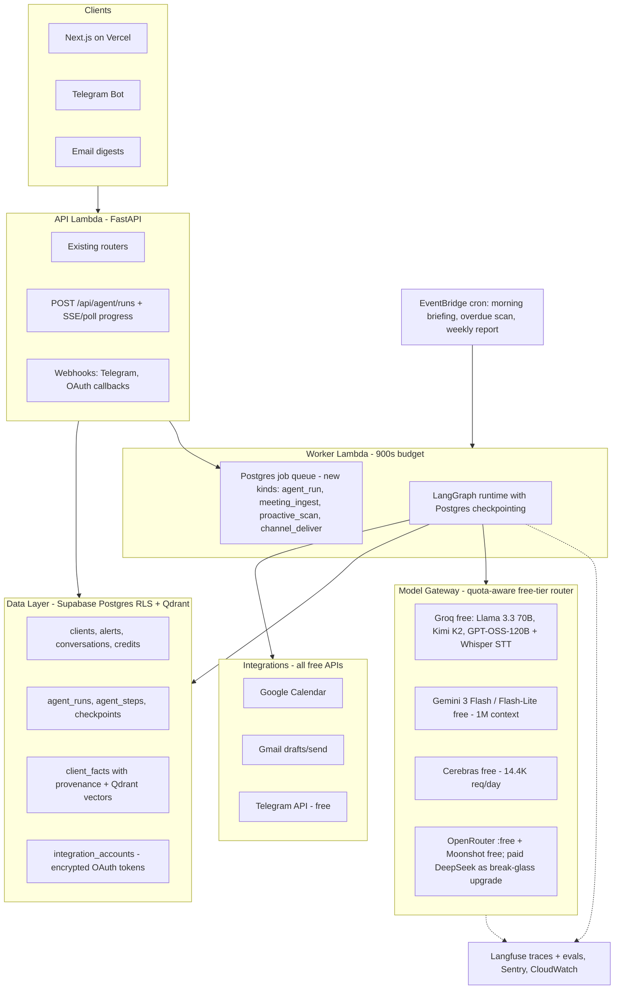
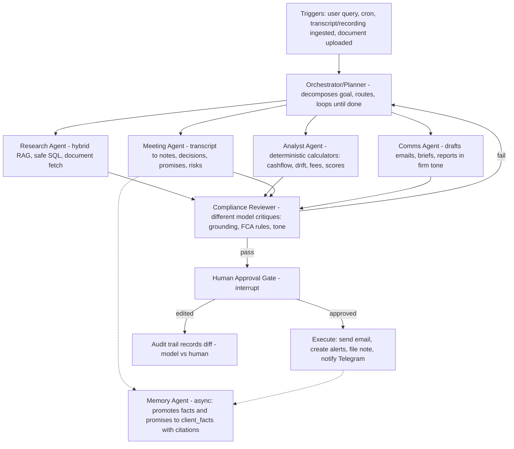

# KritiFin → Multi-Agent AI Platform: Strategy & Roadmap

**Product:** KritiFin (Proactive Financial Agent)
**Audience:** Engineering, product, founders
**Last updated:** 25 July 2026
**Status:** Approved. Days 0–30 foundation in progress (see [Implementation status](#implementation-status)).
**Cost target:** **$0/month recurring** (free tiers only; one optional one-time $10 OpenRouter unlock).

---

## Where the project stands (honest assessment)

The foundation is unusually strong for a portfolio project: real multi-tenancy with Postgres RLS (`backend/app/tenancy.py`), a durable Postgres job queue with an event-driven worker Lambda (`backend/app/services/jobs.py`, `backend/app/worker.py`), hybrid RAG (Qdrant + structured SQL), credits with reserve/commit/release, audit logging, prompt-injection defenses, ~37 test files, and real CI/CD. The existing research docs ([high-impact-features-2026.md](../feature-research/high-impact-features-2026.md)) are genuinely good market analysis.

What it is **not** yet: agentic. Every AI feature is one prompt → one completion via `backend/app/services/llm.py`. No tool calling, no planning, no streaming (Function URL is `BUFFERED`), the thinking UI is simulated (`AiThinkingCard` rotates fake steps), memory is a 20-message window, one hardcoded provider (OpenAI GPT-4o — the most expensive choice available), zero external integrations, and no eval harness. The worker handles exactly one job kind: `upload`.

**Positioning:** stop being "chat over documents." Become **the AI chief of staff for financial advisers** — a team of specialized agents that listens to meetings, remembers every promise, plans the adviser's day, drafts every follow-up, and never sends anything without approval. The UK Consumer Duty compliance layer is the moat; US competitors (Jump, Zocks — $170M+ raised) don't have it.

---

## 1. Ideal system architecture

Keep the skeleton (FastAPI + Supabase + Qdrant + Next.js + Lambda). It's cheap, already hardened, and every layer below slots into it. Add four capabilities: a model gateway, an agent runtime, integrations, and observability.

Key runtime decision: **agent runs execute in the worker Lambda** (900s timeout) via the existing job queue, not on the 180s API path. The API enqueues an `agent_run` job and returns a `run_id`; the frontend gets real progress from `agent_steps` (poll first — the ingest polling pattern in `frontend/lib/ingest.ts` already does this — then SSE via Lambda Web Adapter `RESPONSE_STREAM` as an upgrade). Postgres checkpointing makes runs survive Lambda timeouts/retries — resume from last checkpoint.

## 2. Multi-agent design

Supervisor pattern with **6 specialized agents + a human gate**. Not 15 agents — each one exists because it has distinct tools, prompts, or trust levels. Existing services become their tools (`services/scores.py`, `services/compliance.py`, `services/analytics.py` are already pure functions).

- **Orchestrator/Planner** — best free tool-caller available per quota: Kimi K2 on Groq, GPT-OSS-120B on Groq, or Gemini Flash. Plans, delegates, decides when done. Hard caps: max steps, max tokens, per-run quota budget.
- **Research Agent** — Llama 3.3 70B / Qwen3-32B (Groq or Cerebras free). Tools: Qdrant search, structured-context SQL (read-only, RLS-scoped, whitelisted queries), document fetch.
- **Analyst Agent** — LLM chooses tools; **math is deterministic Python** (retirement projection, cash-drag, fee reconciliation, engagement scores). Never let the LLM do arithmetic.
- **Meeting Agent** — extraction specialist: structured notes, action items → alerts, promises, vulnerability signals (FCA FG21/1), advice-vs-information classification.
- **Comms Agent** — drafts only. Nothing sends without the gate.
- **Compliance Reviewer** — a *different* model family than the generator (cross-model critique — e.g. Gemini reviews what a Groq-hosted model wrote). Checks citation grounding, invented facts, regulated-advice boundary, Consumer Duty signals. Fails back to the orchestrator with reasons; the retry loop is visible in the UI.
- **Memory Agent** — async fact promotion into `client_facts` (typed, cited, versioned): the "what you promised last time" feature — Jump's signature — falls out of this table.
- **Human gate** — graph interrupt surfacing to an Approval Inbox. The existing audit/approve endpoints (`services/audit.py`) become the persistence for it.

**Orchestration choice: LangGraph 1.0** (not CrewAI/AutoGen/raw loops). Reasons: durable execution + Postgres checkpointing matches the queue architecture; `interrupt()` is a first-class human-in-the-loop primitive (essential in a regulated domain); replayable state enables the audit/replay UI; it's the recognized production standard. Use LangGraph **only as the state machine** — keep our own Pydantic schemas and prompt templates; don't adopt the wider LangChain abstraction stack.

## 3. Tech stack recommendations (zero-cost edition, July 2026)

**Model gateway — a quota-aware free-tier router** behind the existing `complete()` facade in `backend/app/services/llm.py`, so all current prompt surfaces keep working untouched. It tracks per-provider/per-model RPM+RPD counters in Postgres, routes each purpose to the best free option with quota remaining, backs off on 429, and falls down a chain. OpenAI becomes an **optional env-gated plug-in**, no longer a requirement.

The free-key stack (all $0, combined ~20K+ requests/day):

- **Groq free** — 30 RPM; per-model daily caps stack: Llama 3.1 8B (14,400/day), Llama 3.3 70B, Llama 4 Scout, Kimi K2, GPT-OSS-120B, Qwen3-32B (~1,000/day each). Fastest inference anywhere, US-hosted. Also **Whisper large-v3-turbo free: 2,000 transcriptions/day** (paid would be $0.04/hr vs OpenAI's $0.36).
- **Gemini free** — Gemini 3 Flash: 10 RPM / 1,500 per day; Flash-Lite: 15 RPM / 1,000 per day; 250K TPM; 1M context — the free long-document workhorse for extraction.
- **Cerebras free** — 30 RPM / 14,400 per day (~1M tokens/day), hosts Llama + Qwen + GPT-OSS; the second fast provider so no single point of failure.
- **Moonshot/Kimi free** — 1,000 requests/day on Kimi K2 base (China-hosted: demo workspace only, never real PII).
- **OpenRouter `:free`** — 28+ models (DeepSeek V3/R1, Llama 4, Qwen3), 50 req/day, or 1,000/day after a **one-time** $10 that never expires — the only (optional) spend in the whole stack.
- **Purpose routing:** planner/tool loops → Kimi K2 or GPT-OSS-120B on Groq, or Gemini Flash; synthesis/drafts → Llama 3.3 70B (Groq/Cerebras); long-doc extraction → Gemini Flash (1M ctx); classification/chips → Llama 3.1 8B (huge 14.4K/day quota); reviewer → always a different family than the generator.
- **Embeddings (removes the last OpenAI dependency): fastembed with bge-small-en-v1.5 (384-dim)** — Qdrant's own ONNX library running in-process on Lambda CPU. No API, no rate limit, $0 forever — critical because the query path embeds every copilot message and must never hit a daily cap. English-retrieval quality is at parity with OpenAI text-embedding-3-small; 384-dim vectors are 4x smaller so the free 1GB Qdrant tier holds 4x more chunks; the ~67MB model bakes into the existing container image (~1–2s cold-start cost, ~200MB RAM, fits 1024MB). One-time re-index into a new Qdrant collection (replayable from `ingested_documents`). Upgrade path: bge-base-en-v1.5 (768-dim) if evals demand; avoid Qwen3-Embedding/bge-m3 (1–2GB, forces Lambda memory bump). API fallback if ever wanted: Gemini embedding free tier (~1,000/day — fine for ingest bursts, wrong for the query path).
- **Break-glass upgrade path (only if real users outgrow free tiers):** paid DeepSeek V4 Flash at $0.14/$0.28 per M tokens — a full agent run costs ~$0.002. The gateway makes this a config change, not a code change.
- **Data-residency note:** the primary free providers (Groq, Cerebras, Gemini) are US-hosted — consistent with a "never trained on, never China-routed" trust posture for real data; Moonshot/Chinese endpoints stay demo-only.

**Integrations (all $0):**

- **Meetings — platform integration SKIPPED (decision).** No Zoom/Meet/Teams bots, no Recall.ai, no live browser capture. Meeting intelligence works entirely through integration-less inputs: **paste transcript** (already shipped) and **upload a recording file** → Groq Whisper free (2,000/day). If auto-join ever becomes a must, the future options are documented: self-hosted open-source Attendee or Vexa on a free VM — not on the roadmap.
- **Calendar: Google Calendar API** (free) — read events, match attendees to clients, auto-generate pre-meeting briefs. Microsoft Graph later only if a real user asks.
- **Email: Gmail API** (free) — create drafts / send approved follow-ups in the adviser's own mailbox. **Resend** free tier (3K emails/mo) for system digests.
- **Telegram Bot API — completely free**, no approval process, 30 msg/s. The highest-wow-per-dollar channel: morning briefing push, "reply to ask your book anything," approval buttons. Build this before WhatsApp.
- **WhatsApp Cloud API** — no platform fee but per-template-message pricing + Meta verification + template approval friction. Defer. **Slack** (free) only if targeting teams.

**Observability & evals (all $0):**

- **Langfuse Cloud Hobby (free): 50K observations/month, 2 users, 30-day retention, no credit card** — traces every agent step/tool call/token count. One callback in the gateway + graph instrumentation. (Self-hosting Langfuse v3 needs ClickHouse+Redis+S3 — not worth it. Fallbacks: Helicone free 10K req/mo, Arize Phoenix single-container.)
- **Eval harness in CI:** golden set of ~50 adviser Q&A/brief/extraction cases; graded on grounding, citation accuracy, hallucination rate, compliance-boundary adherence (LLM-as-judge on a free-tier model + deterministic checks). Runs on prompt changes in GitHub Actions free minutes — `services/prompts.py` `PROMPT_VERSION` is the cache-busting hook. Publish results on a public quality page.
- **Zero-cost bill of materials:** Vercel Hobby + AWS free tier + Supabase free + Qdrant Cloud free 1GB + Groq/Cerebras/Gemini/Moonshot free tiers + fastembed + Telegram + Gmail/Calendar APIs + Langfuse Hobby + Sentry free + GitHub Actions = **$0/month**, with a one-time optional $10 OpenRouter unlock.

**Frontend:** stay Next.js/TanStack. Add: agent timeline component (replace simulated `AiThinkingCard` with real `agent_steps`), Approval Inbox page, integrations settings, run replay view.

## 4. Top 25 features ranked (impact 1–5 / effort S=days, M=1–2wk, L=3wk+)

1. **Quota-aware free-tier model gateway** — 5/M — routes every purpose across Groq/Cerebras/Gemini/OpenRouter free tiers with RPM/RPD tracking, 429 backoff, fallbacks; drops the LLM bill to $0 and is itself a portfolio-grade system.
2. **Agentic copilot v1** — 5/M — LangGraph plan→retrieve→analyze→review→answer replacing single-shot chat; visible reasoning.
3. **Real agent timeline UI** — 5/S — real steps/tool-calls streamed to the UI; the single biggest demo upgrade.
4. **Langfuse tracing** — 5/S — every run traced with cost/latency per step.
5. **Golden-set eval harness in CI** — 5/M — grounding/hallucination/compliance scores gating prompt changes.
6. **Audio upload → Whisper transcription** — 5/S — Groq free tier; voice memos + meeting recordings feed the existing dual-path pipeline.
7. **Meeting agent (transcript → intelligence)** — 5/M — structured notes, decisions, action items → alerts, promises, vulnerability flags.
8. **Approval Inbox (human gate)** — 5/M — graph interrupts as a reviewable queue; edits diffed vs model output for audit.
9. **Morning briefing push (proactive cron)** — 5/M — EventBridge → agent composes per-adviser briefing → email/Telegram before 8am.
10. **Gmail integration** — 5/M — approved follow-ups appear as drafts in the adviser's mailbox.
11. **Google Calendar sync** — 5/M — attendee→client matching; briefs auto-ready 24h before each meeting.
12. **Voice memo capture** — 4/S — adviser dictates a note after any meeting (in-app mic recording → free Whisper → meeting agent); replaces skipped meeting-platform capture with a zero-integration habit that works for in-person meetings too.
13. **Client memory graph ("what you promised")** — 5/M — typed facts/promises with citations; surfaces in briefs and pre-meeting prep.
14. **Compliance reviewer agent** — 5/M — cross-model critique + FCA rule checks as a blocking gate; UK moat, unique among portfolios.
15. **Token streaming chat** — 4/M — Lambda Web Adapter RESPONSE_STREAM or hybrid polling; kills the fake thinking card latency feel.
16. **Telegram two-way channel** — 4/S — free; briefing push, quick Q&A, approve/reject buttons from your phone.
17. **NL book analytics (safe SQL tool)** — 4/M — "clients >20% cash?" → whitelisted, RLS-scoped queries with rendered results.
18. **Deterministic scenario calculators** — 4/M — retirement/cashflow/fee-drag Python tools the analyst agent calls; LLM never does math.
19. **Agent run replay + audit UI** — 4/M — step-through past runs with full prompt/context/decision inspection; compliance + debugging + wow.
20. **Cost dashboard per org/feature/model** — 4/S — extend `services/llm_usage.py`; "this answer cost £0.0004."
21. **Weekly book-health report** — 4/S — scheduled agent → reviewed → emailed PDF; recurring visible value.
22. **RAG v2** — 4/M — hybrid dense+sparse retrieval, reranking, recency/doc-type weighting — justified by eval scores, not vibes.
23. **Suitability report drafter** — 5/L — multi-agent long-form generation with citations + review gate; biggest ROI in the UK market (~4–6 hrs/report manual), build once the loop is proven.
24. **Public trust page + model cards** — 3/S — residency, subprocessors, "never trained on your data," live eval scores.
25. **WhatsApp/Slack channels** — 3/M — after Telegram proves the pattern.

## 5. 30/60/90-day roadmap

**Days 0–30 — Agent foundation (make intelligence visible):**

- Free-tier model gateway + quota router + usage tracking (#1, #20); LLM bill hits $0 on day one.
- LangGraph runtime in the worker: `agent_run` job kind, `agent_runs`/`agent_steps` tables, Postgres checkpointing (#2).
- Copilot + brief become agent runs; real timeline UI + polling, then streaming (#3, #15).
- Langfuse + 50-case eval harness in CI (#4, #5).
- Exit demo: ask a hard book-wide question → watch planner delegate to retriever/analyst → reviewer catches an ungrounded claim → corrected, cited answer, with cost shown.

**Days 31–60 — The proactive loop (the product moment):**

- Meeting intelligence: audio upload + free Whisper (#6), meeting agent (#7), voice memos (#12).
- Approval Inbox (#8) + Gmail drafts/send (#10).
- Calendar sync + auto pre-meeting briefs (#11).
- Morning briefing cron + Telegram channel (#9, #16).
- Memory graph with promise tracking (#13).
- Exit demo: upload a meeting recording (or paste transcript) → 2 min later: notes filed, 3 alerts created, follow-up email awaiting approval → approve from Telegram → sent; next morning's briefing references it.

**Days 61–90 — The moat (differentiate + publish):**

- Compliance reviewer agent + evidence pack export (#14).
- NL analytics + scenario calculators (#17, #18).
- Run replay/audit UI (#19); RAG v2 driven by eval data (#22); weekly report (#21); trust page (#24).
- Start suitability drafter (#23).
- Publish: architecture deep-dive blog post, eval-results page, 3-minute demo video, README overhaul with the agent-graph diagram.

## 6. Features that best demonstrate senior AI engineering

1. **Durable multi-agent orchestration** — checkpointed graphs surviving Lambda timeouts, resumable mid-run, with interrupts.
2. **Eval harness gating CI + public quality metrics** — the #1 separator between demo-builders and production AI engineers.
3. **Quota-aware multi-provider model routing** — right free model per task, RPM/RPD budget tracking, 429 backoff, fallback chains, per-answer cost attribution — running an entire agent platform for $0 is itself the story.
4. **Cross-model compliance review with human-in-the-loop interrupts** — guardrails as architecture, not a system prompt line.
5. **Agent replay/audit UI** — full observability into non-deterministic systems; doubles as the FCA-alignment story.
6. **Multi-tenant agent security** — every tool RLS-scoped through `TenantContext`; agents physically cannot cross tenants.

## 7. Features most likely to attract users and clients

1. Meeting recording/transcript → auto follow-up loop (#6/#7/#8/#10) — the workflow the entire adviser-AI market converged on; saves hours per week, with zero platform integration required.
2. Morning briefing push (#9) — daily habit-forming touchpoint that makes "proactive" tangible.
3. "What you promised" tracker (#13) — Jump's signature feature; instantly legible value to any professional.
4. Approval Inbox (#8) — converts AI-fear into AI-control; the feature that makes advisers (and compliance officers) say yes.
5. Telegram briefings + approvals (#16) — mobile-first delight, zero cost.
6. Agent timeline (#3) — trust through transparency; demos brilliantly to clients and interviewers alike.
7. Trust page + evals (#24/#5) — enterprise buyers ask about data handling first; almost no vendor answers publicly.

## 8. What to build first (flagship move)

**Weeks 1–3: the visible agentic copilot + free-tier model gateway (#1 + #2 + #3 + #4).** Rationale: it transforms the perceived product from "chatbot with a fake spinner" to "watch a team of AI agents work" using data flows that already exist; it forces the platform decisions (runtime, state, streaming, routing) that everything else builds on; it takes the LLM bill to $0 which makes every later feature free to run; and it produces the single demo/interview moment with the highest skill density. Meeting intelligence (days 31–60) is the user-value flagship, and it lands on this runtime in half the time once the runtime exists.

**Deliberately not building (over-engineering guardrails):** any Zoom/Meet/Teams platform integration — bots, Recall.ai, or live capture (decision: transcript paste + audio upload cover the value); microservices/K8s (two Lambdas are fine past 10K users); Redis/SQS (Postgres queue holds until sustained depth >10); Kafka/event buses; fine-tuning (routing + evals first); full LangChain adoption; agent-to-agent protocols; building our own vector DB or auth. Keep deterministic fallbacks everywhere — "AI-optional degradation" is itself a senior pattern worth keeping.

**Risks to manage:** free tiers are the whole cost model, so treat quota as a first-class resource — per-provider RPM/RPD counters, aggressive caching (already built), queue-based retries with backoff, and multi-provider fallback chains; tool-calling JSON from smaller free models needs Pydantic validation + one repair retry; free-tier terms can change (the gateway makes switching providers a config change, and paid DeepSeek at ~$0.002/agent-run is the break-glass); Moonshot/Chinese endpoints stay demo-only for the residency story; credits model needs a per-run reservation (one reservation spanning an agent run, released on failure — extend `services/credits.py`); agent loops need hard budget/step caps enforced in the runtime, not the prompt.

---

## Implementation status

| Workstream | Status |
|------------|--------|
| Roadmap doc (this file) | Done |
| Quota-aware free-tier model gateway (`services/model_gateway.py`) | Done — routes across Groq/Cerebras/Gemini/Moonshot/OpenRouter with Postgres RPM/RPD counters, cooldowns, fallback chains; OpenAI/DeepSeek optional |
| Agent runtime (LangGraph in worker, `agent_runs`/`agent_steps`) | Done — job kind `agent_run`, migrations 0012–0013, RLS-scoped tool layer |
| Agentic copilot + brief (plan → gather → synthesize → review graph) | Done — cross-model reviewer, deterministic citation gate, one revision loop, per-run credit reservation |
| Real agent timeline UI + run detail view | Done — `AgentTimeline` replaces the simulated card; `/runs/[id]` replay view |
| Langfuse tracing + 50-case eval harness in CI | Done — `services/tracing.py` (env-gated) + `backend/evals/` gating CI on prompt/gateway changes |
| fastembed embeddings migration (OpenAI removal) | Done — local bge-small-en-v1.5 default, per-provider collections, `scripts/reindex_embeddings.py`; `openai` dropped from requirements |

## Related documentation

- [AI evaluation framework](../ai-evaluation.md) — metric definitions the eval harness implements
- [High-impact features 2026](../feature-research/high-impact-features-2026.md) — market research behind this roadmap
- [Implementation plan (pre-agent era)](IMPLEMENTATION_PLAN.md) — superseded milestones M6–M7 fold into this roadmap
- [Features & implementation](../../FEATURES_AND_IMPLEMENTATION.md) — shipped feature inventory
