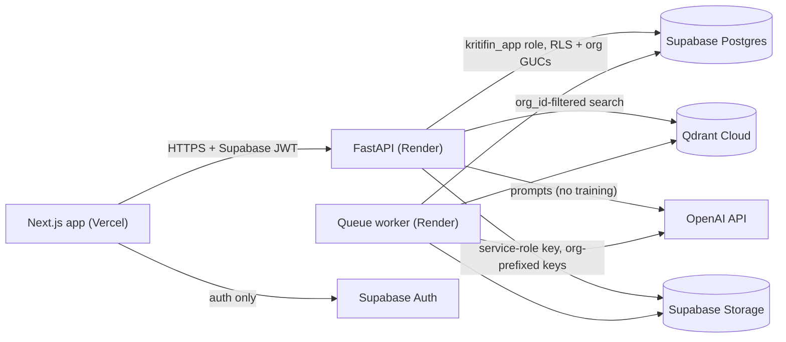

# KritiFin threat model and data-flow overview

_Last updated: 17 Jul 2026. Companion to [security-audit.md](security-audit.md)
and the production-readiness RFC. STRIDE-lite, scoped to the current
architecture (Vercel + Render + Supabase + Qdrant + OpenAI)._

## Data flow

Data classification: client PII + financial detail (highest), adviser account
data, AI outputs (derived PII), operational telemetry (scrubbed, no PII).

## Trust boundaries and controls

1. **Browser → API.** Supabase JWT required (`AUTH_MODE=required`; boot
   refusal otherwise; demo mode impossible in production). CORS restricted to
   configured origins, no credentials mode, enumerated methods/headers.
   Per-org rate limiting. No API keys in the bundle.
2. **API → Postgres.** Least-privilege `kritifin_app` role (NOBYPASSRLS,
   append-only on audit_log); RLS policies on every table keyed on
   transaction-local GUCs; all queries additionally org-scoped in SQL; the
   Supabase Data API (PostgREST) is neutralised by RLS + revoked grants for
   `anon`/`authenticated`.
3. **API → Qdrant.** Single search wrapper that refuses filter-less queries;
   every point carries `org_id`; payload indexes for filtered search.
4. **API → OpenAI.** No training on client data (API terms + posture
   endpoint). Prompt-injection posture: retrieved content is delimited and
   instructed-as-untrusted, injection-pattern stripping as defense-in-depth,
   no tool-calling on untrusted context. Residual risk: a hostile document can
   still bias output for the org that uploaded it — bounded to that tenant by
   the data plane.
5. **Uploads.** Extension allowlist, magic-byte checks, 20MB cap, DOCX
   zip-bomb guards (entry count, expansion, compression ratio), PDF page/char
   caps, parsing in the worker process. Malware scanning is a known gap
   (Phase 2: quarantine + async scan); mitigated today by validation plus
   never executing/serving uploaded content.

## STRIDE summary

- **Spoofing** — JWT verification via project JWKS (ES256) with issuer/audience
  pinning; HS256 legacy path scheduled for removal once both environments are
  confirmed on asymmetric keys.
- **Tampering** — parameterized SQL everywhere (CI guard bans dynamic f-string
  SQL); append-only audit_log (revoked DML + trigger); expand-contract
  migrations reviewed as SQL.
- **Repudiation** — durable audit trail: who/what/when/where + before/after +
  request_id on every material action and AI generation.
- **Information disclosure** — the core risk for this product. Four
  independent tenant-isolation layers (RLS, scoped SQL, scoped caches, scoped
  vectors) each covered by CI-blocking tests; logs and Sentry scrub PII;
  public error messages are generic.
- **Denial of service** — per-org rate limits, bounded uploads/reads, LLM
  input clamps, statement-level caps on extraction; Render Starter removes
  cold-start amplification.
- **Elevation of privilege** — single non-admin DB role; SECURITY DEFINER
  functions limited to provisioning and queue claiming with pinned
  search_path; no dynamic role grants; break-glass admin URL confined to
  migrations and documented in runbooks.

## Accepted residual risks (review before GA)

1. No malware scanning of uploads (validation only) — Phase 2.
2. OpenAI processes prompts in the US — disclosed via posture endpoint; Azure
   OpenAI UK South is the Phase 3 residency option.
3. In-memory per-instance cache — safe at one instance (org-prefixed keys);
   Redis gate documented for >1 instance.
4. Demo mode exists in the codebase — triple-guarded (explicit env, production
   refusal, shared workspace only) but code-present.
5. Supabase anon key grants Data API reachability — inert due to RLS +
   revoked grants, verified by tests, but the surface exists.
